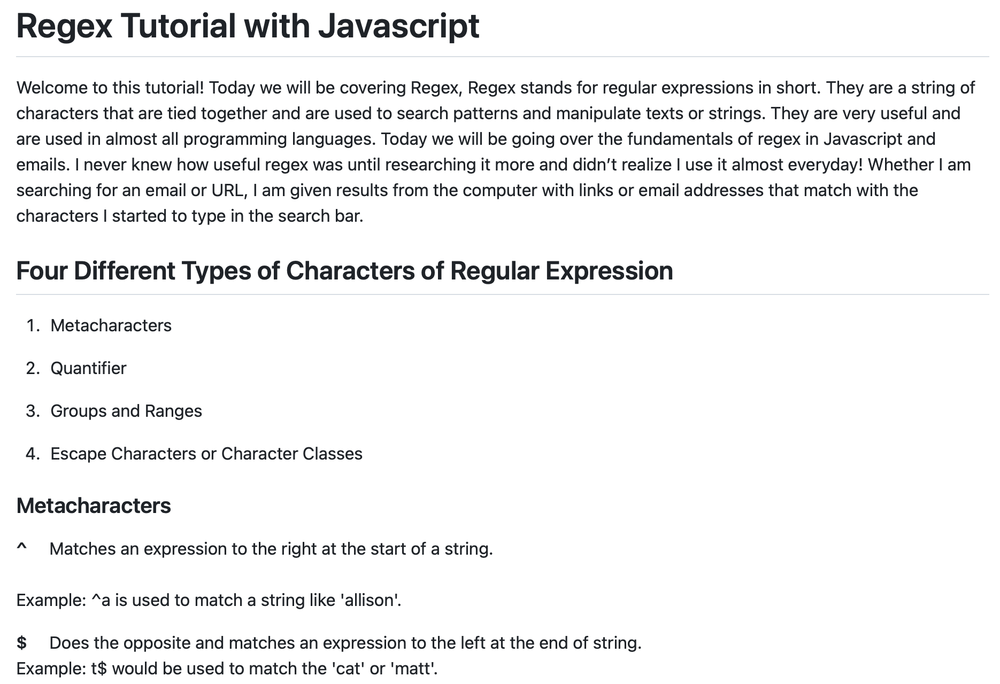
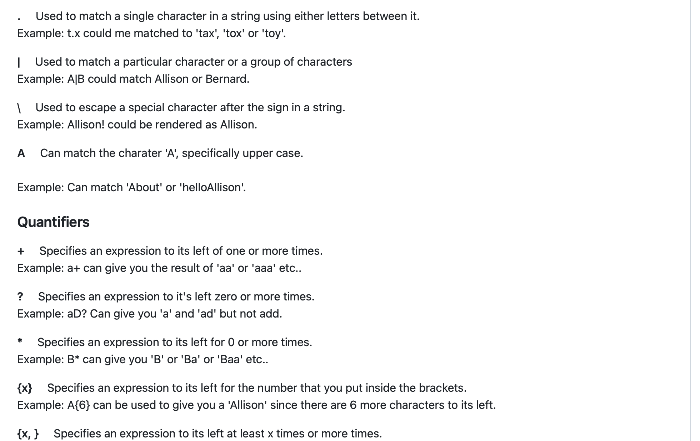
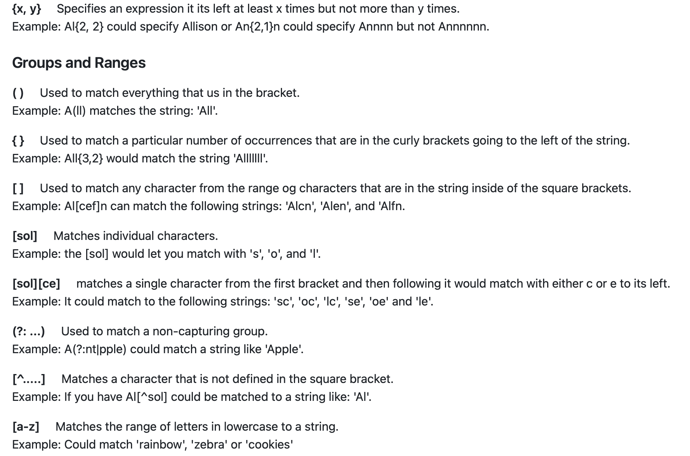
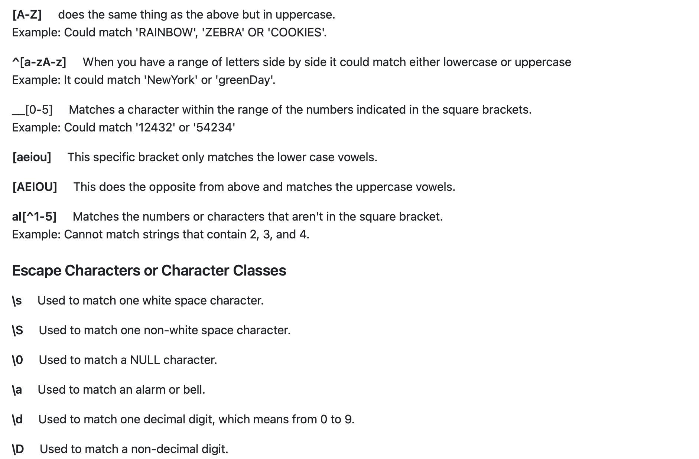
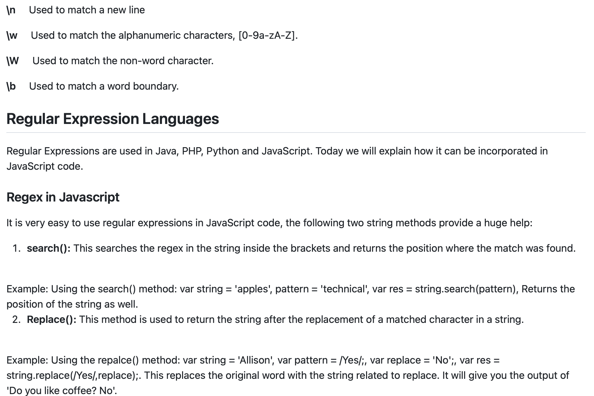

# Regular Expressions Tutorial

## Description
This tutorial can be used by anyone who wants to learn about using Regex with matching emails and how to utilize it appriprately on JavaScript. I designed this tutorial to be more like an index type of structure. I know that I personally am able to study better when everything is aligned, almost like a key and value format but also including an example to be able to see a real-life problem. 

## Table of Contents

-[User Story](#User-Story)

-[Acceptance Criteria](#Acceptance-Criteria)

-[Tutorial Screenshots](#Tutorial-Screenshots)

-[Links](#Links)

-[Future Development](#Future-Development)

-[Credits](#Credits)

-[Author](#Author)

## User Story
```md
AS A web development student
I WANT a tutorial explaining a specific regex
SO THAT I can understand the search pattern the regex defines
````

# Acceptance Criteria
```md
GIVEN a regex tutorial
WHEN I open the tutorial
THEN I see a descriptive title and introductory paragraph explaining the purpose of the tutorial, a summary describing the regex featured in the tutorial, a table of contents linking to different sections that break down each component of the regex and explain what it does, and a section about the author with a link to the author’s GitHub profile
WHEN I click on the links in the table of contents
THEN I am taken to the corresponding sections of the tutorial
WHEN I read through each section of the tutorial
THEN I find a detailed explanation of what a specific component of the regex does
WHEN I reach the end of the tutorial
THEN I find a section about the author and a link to the author’s GitHub profile
````

## Tutorial Screenshots






## Links
Github link: https://github.com/Allicris/Reg-Ex
Deployed link: https://allicris.github.io/Reg-Ex/

## Installation
-Navigate to my repository: https://github.com/Allicris/Reg-Ex

-Click on the green “Code” Button

-Select SSH and copy

-Open your terminal and navigate to the appropriate folder you want the repository in.

-Type the following in the terminal:

a.     git clone (the ssh key)

b.     cd (repository name)

c.      Type code . to open the repository in VS Code


## Future Development
I will update this repository if I find new information or if there are any updates made to Regular Expressions. I welcome anyone to add useful information

## Credits
I would like to give credits to the following website, I was able to learn about the different varieties of expressions that can be used in Regex and learn how it would in Javascript and for emails. This websites has helped me better understand the importance and significance behind the usage of Regex.
<br>
<br>
Link:
<br>
https://www.javatpoint.com/regex

## Author
Allison Cristine Serrano
